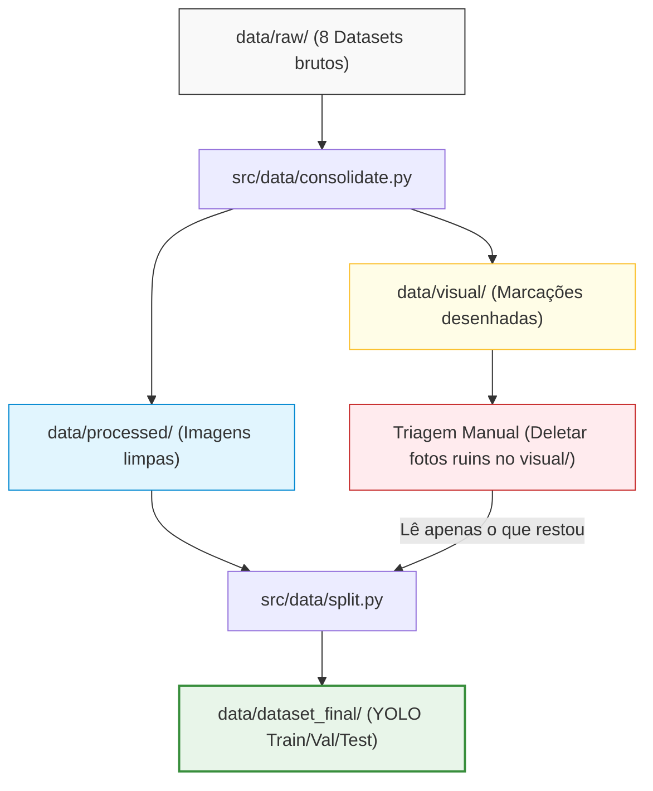

# 01. Preparação, Curadoria e Divisão de Dados (Pipeline YOLO)

Este documento orienta a equipe sobre o fluxo de estruturação das bases de dados originais (baixadas do Roboflow) para o treinamento do nosso modelo YOLO para detecção de descarte de lixo.

Se você está pegando o projeto "do zero", este guia explica a arquitetura, as decisões técnicas (rastreabilidade, curadoria e divisão dos dados) e o passo a passo de como rodar o pipeline.

---

## 1. Fluxo Geral do Pipeline de Dados

Para entender como os dados caminham no repositório, veja o fluxo abaixo:



---

## 2. Como Obter os Dados (Download do Google Drive)

Para rodar este pipeline localmente, você deve obter a pasta de dados:

1. Acesse a pasta compartilhada no Google Drive: [Acesse aqui](https://drive.google.com/drive/u/0/folders/1mBmlk1TqWhN3xnKuCI4P0qvJtkqK7I6G).
2. Baixe a pasta `data` completa e extraia-a na raiz do projeto (de forma que o caminho final seja `dumping-of-garbage/data/`).

> [!TIP]
> **Atalho de Curadoria (Consolidação já executada):**
> Como já rodamos a consolidação inicial de todas as bases de dados, a pasta `data` no Drive já contém os datasets brutos em `raw/`, as cópias padronizadas em `processed/` e as marcações visuais prontas para triagem em `visual/`.
> 
> Ao baixar a pasta inteira, **você não precisa reexecutar a consolidação**. O seu próximo passo imediato será apenas abrir a pasta `data/visual/` localmente e começar a deletar as fotos que não deseja.

### Por que não subir estes arquivos de dados ao repositório Git?

> [!CAUTION]
> **Subir bases de dados ao Git é considerado uma PÉSSIMA prática de engenharia pelas seguintes razões:**
>
> 1. **Inchaço do Repositório (Bloat)**: O Git foi projetado para controlar código-fonte (arquivos de texto leve). Imagens e labels somam gigabytes de arquivos binários pesados. Subi-los deixará o repositório extremamente lento.
> 2. **Histórico Acumulado e Lento**: Toda vez que uma imagem é adicionada, alterada ou removida, o Git armazena internamente uma cópia completa desse arquivo binário no histórico `.git`. A pasta do repositório crescerá indefinidamente e qualquer `git clone` futuro demorará horas para baixar.
> 3. **Limitações de Plataformas**: Serviços como o GitHub bloqueiam commits com arquivos individuais maiores que 100MB e limitam o tamanho total do repositório.
> 4. **Separação de Responsabilidades**: O Git gerencia o **código** (a inteligência). O **dado** (imagens de treino) deve ser mantido e versionado em armazenamentos apropriados (Google Drive, AWS S3, Google Cloud Storage, ou usando ferramentas como DVC).

---

## 3. Metodologia de Desenvolvimento: Scripts (.py) vs. Notebooks (.ipynb)

No desenvolvimento profissional de Machine Learning, adotamos uma abordagem híbrida que une robustez e interatividade:

* **Scripts Python (`src/data/consolidate.py` e `src/data/split.py`)**: 
  Toda a lógica complexa de manipulação de arquivos, parsing de metadados, desenho com OpenCV e divisão estratificada é escrita em módulos de código limpo, modular e reutilizável. Isso evita poluir os notebooks com centenas de linhas de código estrutural e facilita a portabilidade e manutenção.
  
* **Jupyter Notebooks (`notebooks/01_data_consolidation.ipynb` e `notebooks/02_split_dataset.ipynb`)**:
  Funcionam como as "interfaces gráficas" do desenvolvedor. Neles, importamos as funções dos scripts e executamos o pipeline de forma interativa. A grande vantagem é poder gerar gráficos de distribuição das classes, estatísticas das imagens de cada base e exibir amostras visuais das bounding boxes lado a lado diretamente no editor.

---

## 4. Justificativa da Curadoria Visual (Filtro de Data Augmentation)

> [!IMPORTANT]
> **Por que realizamos triagem manual apagando arquivos de `data/visual/`?**
>
> As bases baixadas do Roboflow vêm pré-processadas com técnicas automáticas de **data augmentation** (como rotações, espelhamento, ruídos de imagem, etc.) aplicadas por padrão.
>
> Se treinarmos o modelo diretamente com essas distorções descontroladas, corremos o risco de enviesar o treinamento. Para garantir a **criticidade dos dados**, o fluxo funciona assim:
> 1. O script de consolidação gera a pasta `data/visual/` com os desenhos das anotações originais sobre as imagens.
> 2. O usuário revisa essas imagens e **deleta manualmente** aquelas que contêm augmentations ruins, distorcidas, desfocadas ou duplicadas.
> 3. Ao fazermos essa limpeza, garantimos que o conjunto de treinamento final seja limpo (Golden Dataset). No futuro, nós mesmos aplicaremos técnicas de data augmentation de forma consciente e controlada durante o treinamento do YOLO, tendo controle total do que está sendo treinado.

---

## 5. Estrutura de Pastas e Componentes

A organização do projeto e a função de cada diretório e arquivo é detalhada a seguir:

```text
dumping-of-garbage/
├── data/
│   ├── raw/                         # Datasets originais do Roboflow (somente-leitura)
│   ├── processed/                   # Imagens originais e rótulos unificados (classe 0)
│   ├── visual/                      # Imagens com bounding boxes desenhadas (para triagem)
│   └── dataset_final/               # Imagens e rótulos finais divididos para o YOLO
├── notebooks/
│   ├── 01_data_consolidation.ipynb  # Executa a consolidação e exibe análises
│   └── 02_split_dataset.ipynb       # Executa o split e plota distribuição estratificada
├── src/
│   └── data/
│       ├── consolidate.py           # Script python de consolidação de bases de dados
│       └── split.py                 # Script python de divisão de splits estratificados
├── docs/
│   └── 01_preparacao_dados.md       # Este guia
├── requirements.txt                 # Dependências do projeto (OpenCV, Pandas, PyYAML...)
└── .gitignore
```

*Nota: As pastas de imagens volumosas (`data/raw/`, `data/processed/`, `data/visual/` e `data/dataset_final/`) estão incluídas no `.gitignore` para evitar o envio de dados pesados ao repositório Git.*

---

## 6. Rastreabilidade e Padronização

Ao juntar 8 datasets diferentes, a maior preocupação é a rastreabilidade e a colisão de nomes. Resolvemos isso em duas frentes:

### A. Padronização e Nomenclatura
Mapeamos cada base de dados para um apelido sequencial (`dt1`, `dt2`, ..., `dt8`) gerando o arquivo `data/metadata/mapping.json`.
Todas as imagens e rótulos são renomeados conforme o padrão:
* Exemplo: `street_view_...rf.jpg` do dataset `classificador-de-lixo` (`dt1`) torna-se `lixo-dt1-00001.jpg` e seu rótulo correspondente torna-se `lixo-dt1-00001.txt`.

### B. Planilha de Rastreabilidade (`traceability.csv`)
Toda imagem copiada é registrada em `data/metadata/traceability.csv` guardando o mapeamento exato:
`Nome Consolidado` ──► `Pasta de Origem` ──► `Split de Origem (train/val/test)` ──► `Nome Original do Arquivo`

---

## 7. Divisão Estratificada (Train, Val, Test)

Quando o usuário apaga arquivos da pasta `data/visual/` e roda o script de divisão, ele executa um **split estratificado** (padrão: `70% Treino / 20% Validação / 10% Teste`).
* **O que é e por que usar**: Cada base de dados (`dt1` a `dt8`) tem características de iluminação, câmeras e formatos diferentes. A estratificação garante que a proporção de cada dataset de origem seja mantida constante e proporcional entre os conjuntos de Treino, Validação e Teste. Isso evita que o modelo treine em um tipo de câmera e seja testado em outro completamente diferente, prevenindo o problema de *domain shift* (desvio de domínio).

---

## 8. Guia Passo a Passo para Execução

### Passo 1: Instalação e Preparação
Crie e ative o ambiente virtual e instale as dependências:
```bash
python -m venv .venv
.venv\Scripts\activate
pip install -r requirements.txt
```

### Passo 2: Baixar a Pasta `data`
Baixe a pasta `data` completa do Google Drive (link na Seção 2) e coloque-a na raiz do projeto. Como ela já vem consolidada e processada, você pode ir direto para o Passo 3.

*(Nota: Se no futuro novas bases brutas forem adicionadas a `data/raw/`, você precisará reexecutar a consolidação abrindo o notebook `notebooks/01_data_consolidation.ipynb` ou executando o comando `python src/data/consolidate.py` para atualizar o processamento).*

### Passo 3: Triagem Manual
Abra a pasta `data/visual/` localmente e **deleta** manualmente as fotos que julgar inválidas ou com augmentations indesejadas.

### Passo 4: Executar Separação (Split)
Abra e execute o notebook `notebooks/02_split_dataset.ipynb` (ou via terminal rodando `python src/data/split.py`).
O script detecta quais arquivos restaram em `data/visual/`, lê as imagens limpas correspondentes em `data/processed/` e gera o dataset de treino final estratificado em `data/dataset_final/`, atualizando a rastreabilidade final e gravando o `data.yaml`.
